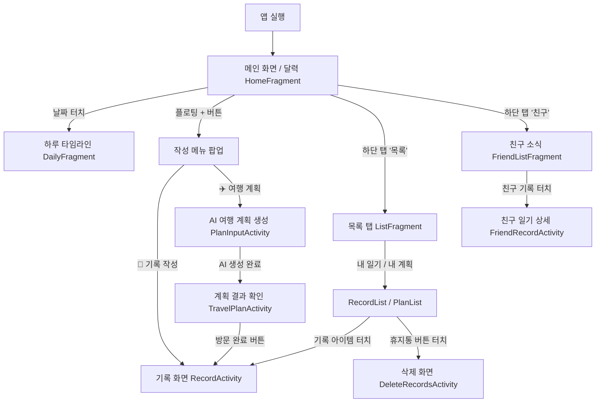

# Harudiary 앱 아키텍처 및 화면 흐름 가이드 (App Flow & Use Case)

이 문서는 `Harudiary_Evaluation_Plan.md`와 `test_all_41_apis.py`를 기반으로 현재 완성된 Harudiary 어플리케이션의 구조를 정리하고, 화면 흐름 및 각 화면에서의 사용자 작업을 구체적으로 정의한 가이드 문서입니다.

---

## 1. 프로그램 개요 (Overview)

Harudiary는 사용자의 **'일상 기록(Record)'**과 AI를 활용한 **'여행 계획(Plan)'**을 하나의 타임라인에 결합한 하이브리드 다이어리 앱입니다.
*   **프론트엔드 (Android):** Retrofit2 비동기 통신을 통해 로컬 DB(SQLite)의 한계를 벗어나 서버와 실시간으로 연동하며, Glide를 이용해 이미지를 렌더링합니다.
*   **백엔드 (Spring Boot & Docker):** 41개의 세분화된 REST API를 제공합니다. MySQL(`harudiary_db`)에 데이터를 영속화하며, Gemini API의 공간 지각 능력을 활용하여 복잡한 길찾기 API 없이도 최단 경로와 이동 시간을 도출해 냅니다.

---

## 2. 전체 화면 흐름도 (Screen Flow)

---

## 3. 화면별 순차적 사용자 작업 (Step-by-Step User Actions)

### 3.1 메인 홈 화면 (`HomeFragment`)
앱의 중심이 되는 대시보드로, 달력과 통계를 한눈에 확인합니다.
1.  **달력 확인:** 이번 달의 달력을 보며 날짜별로 주황색 마커(여행 계획 유무)와 초록색 마커(기록 유무)를 확인합니다.
2.  **하루 타임라인 진입:** 달력에서 특정 날짜를 터치하면, 해당 일자의 아침/점심/저녁 여정과 사진을 한눈에 볼 수 있는 타임라인 뷰(`DailyFragment`)로 넘어갑니다.
3.  **통계 확인:** 상단에서 나의 다이어리 연속 작성 일수(Streak)와 이번 달 총 작성 횟수를 확인합니다.
4.  **친구 소식 브라우징:** 하단 영역에서 내 친구들의 최근 일상과 여행 기록 썸네일을 둘러보고 클릭할 수 있습니다.
5.  **작성 버튼 클릭:** 화면 중앙 하단의 플로팅(`+`) 버튼을 눌러 **'📝 기록 작성'** 또는 **'✈️ 여행 계획'**을 선택합니다.

### 3.2 기록 작성 및 수정 화면 (`RecordActivity`)
현 위치에서 사진과 글을 남기거나, 과거의 기록을 수정하는 핵심 화면입니다.
1.  **환경 자동 매핑 (신규 작성 시):** 화면에 진입하자마자 GPS를 통해 현재 위치(위도/경도)를 파악하고, 백엔드 API(`GET /api/env/current`)를 호출해 현재 주소, 날씨, 기온을 자동 세팅합니다. (시간대 역시 아침/점심/저녁으로 자동 분류)
2.  **내용 및 사진 입력:** 텍스트로 추억을 적거나 버튼을 눌러 갤러리에서 사진을 첨부합니다.
3.  **저장 (Create):** 저장 버튼을 누르면 `POST /api/diary`를 호출하여 새로운 일기를 생성합니다.
4.  **수정 모드 (Edit):** 목록에서 기존에 작성된 일기를 터치해 들어온 경우, **작성 당시의 위치, 날씨, 날짜가 덮어씌워지지 않고 그대로 고정**됩니다. 글이나 사진만 수정한 뒤 저장하면 기존 기록이 업데이트(Update)됩니다.

### 3.3 AI 여행 계획 생성 화면 (`PlanInputActivity` ➔ `TravelPlanActivity`)
Gemini API를 활용하여 최적화된 여행 일정을 짜주는 기능입니다.
1.  **조건 입력:** `PlanInputActivity`에서 방문할 장소 키워드(예: 도쿄), 날짜, 여행 일수, 슬라이더를 이용해 하루 추천 장소 개수를 설정하고 '생성'을 누릅니다.
2.  **딥-생성 대기:** 로딩 화면이 나타나며, 백엔드의 `GeminiOrchestrationService`가 최단 이동 동선과 장소 간 예상 이동 시간을 계산하여 JSON 형태로 반환(`POST /api/travel/recommend/diary`)할 때까지 기다립니다.
3.  **타임라인 확인:** 생성이 완료되면 `TravelPlanActivity`로 넘어가, 시간대별로 아름답게 이어지는 여행 일정과 이동 시간(예: 15분 도보)을 확인합니다.
4.  **방문 완료 (전환):** 실제 여행을 떠나 해당 장소에 도착한 후 **'방문 완료'** 버튼을 누르면, 이 여행 계획이 실제 '나의 일기(Record)' 데이터로 전환되어 영구 보존됩니다.

### 3.4 기록 목록 및 삭제 (`ListFragment` & `DeleteRecordsActivity`)
작성한 데이터들을 관리하는 화면입니다.
1.  **목록 분리:** '목록' 탭에 들어가면 상단 탭을 통해 '내 일기(기록)'와 '여행 계획'을 분리해서 모아볼 수 있습니다.
2.  **일괄 삭제:** 휴지통 아이콘을 누르면 `DeleteRecordsActivity`로 이동합니다. 원하는 날짜의 체크박스를 선택해 전체 삭제(`DELETE /api/diary/{id}`)를 진행할 수 있습니다. 이때, 소중한 **여행 계획(Plan) 데이터는 휴지통에 보이지 않도록 안전하게 보호(필터링)**되어 기록만 깔끔하게 지워집니다.

### 3.5 소셜 및 친구 관리 (`FriendListFragment`)
친구들과 소통하고 일정을 공유하는 화면입니다.
1.  **친구 검색 및 요청:** 친구의 닉네임이나 ID를 검색(`GET /api/friend/search`)하여 친구 요청(`POST /api/friend/request`)을 발송합니다.
2.  **요청 수락/거절:** 상단 뱃지를 통해 들어온 요청을 확인하고, 수락(`POST /api/friend/accept`) 혹은 거절 버튼을 누릅니다.
3.  **리액션 남기기:** 친구 목록에서 친구를 터치해 상세 화면으로 들어간 뒤, 친구의 하루 타임라인에 하트(좋아요)를 남기거나(`POST /api/reaction/toggle`) 댓글을 달아(`POST /api/comment`) 소통합니다.
