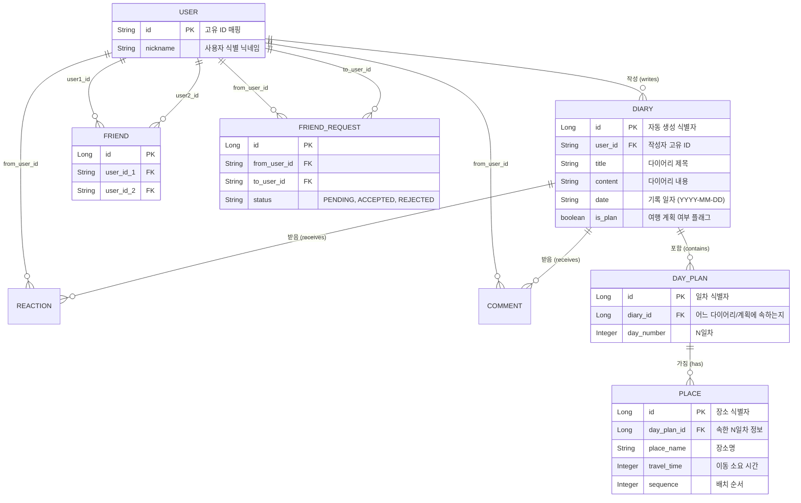

# 🗄️ Harudiary 통합 ERD (Entity-Relationship Diagram)

백엔드 데이터베이스(`harudiary_db`)의 MySQL Entity 구조와 각 객체 간의 연관 관계를 나타낸 ERD 및 스키마 명세입니다.

## 핵심 설계 고려사항
1. **데이터 분리 무결성**: Diary 테이블 내 `is_plan` 플래그를 통해, 통계(스트릭)용 과거 데이터와 미래의 '여행 계획' 데이터가 섞이지 않도록 방어 로직을 구성.
2. **연관성 삭제 처리 (JPA)**: DayPlan과 Place 간의 순서(`sequence`) 조정 및 삭제 시 고아 객체 누수를 방지하기 위해 `orphanRemoval = true`가 적용된 1:N 구조 설계.
3. **사용자 단순화**: 별도의 Password 인증 대신 `String id`를 Primary Key로 두어 복잡성을 최소화하고 소셜 관계를 직관적으로 구성.
